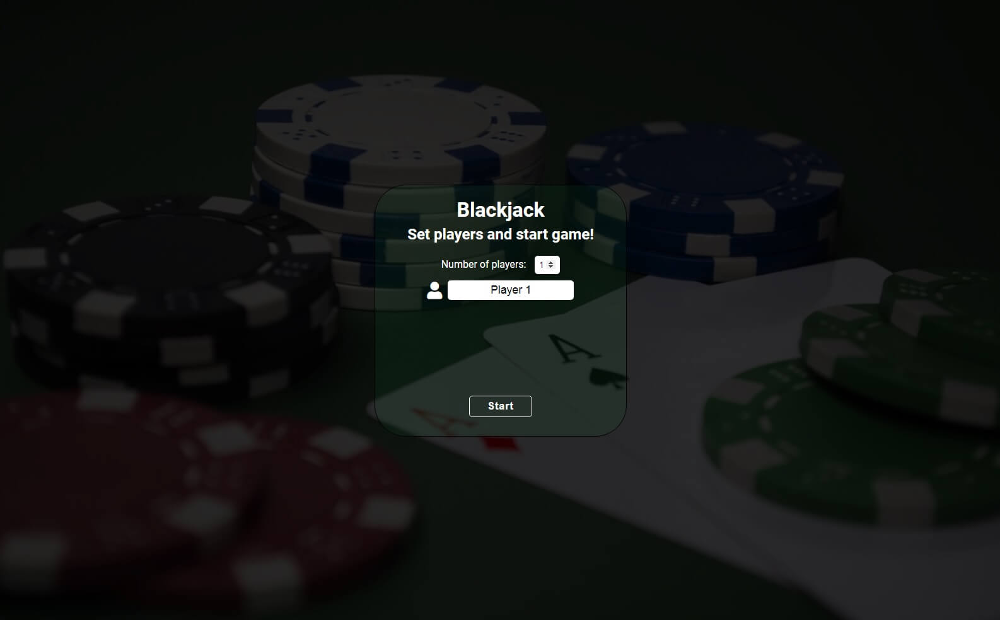
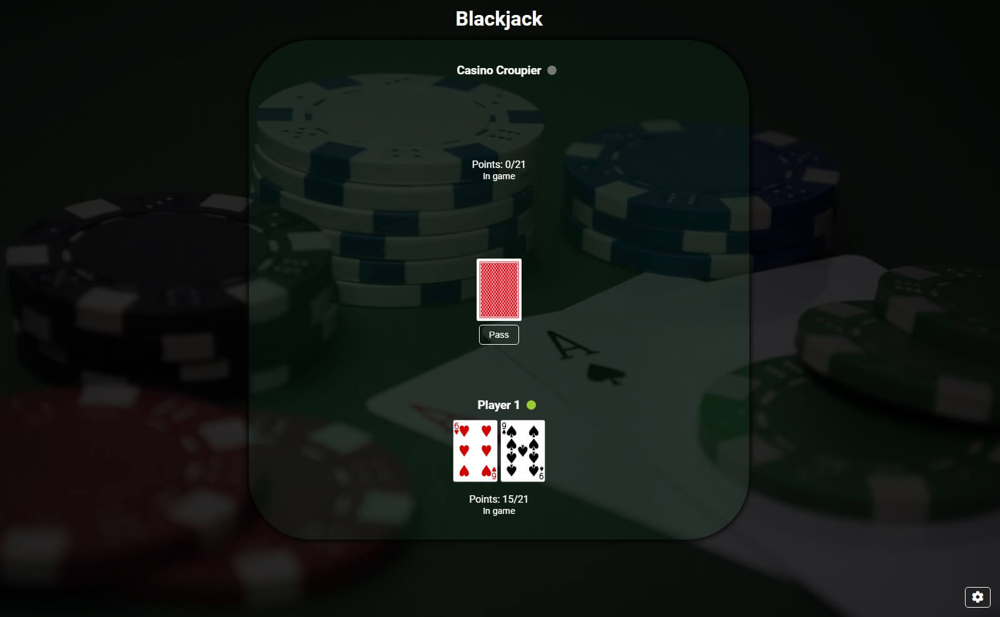

# Blackjack game

Cards game for 1-4 players based on popular blackjack game. In singleplayer mode there is a CPU opponent - Casino Croupier.

## Live

https://bmogielnicki-blackjack-game.netlify.app/

## Technologies

- JavaScript
- SCSS
- Webpack
- Babel
- Deckofcards API

## How to play

### Player wins if

- pulls double ace at start,
- has 21 pts. at the end,
- has biggest score at the end (lower than 21),
- everyone else have more than 21 pts.

Every card figure has other value (points list below). Player starts with 2 random cards. He can pull another card or pass and save his points. If he gets more than 21 points he loses. When he passes, next player's turn starts. When every player end turn, all scores are checked. Wins player with closest points to 21. If best score number has few players there is a draw.

### Figure values

- 2-10 - 2-10pts
- Jack - 2pts
- Queen - 3pts
- King - 4pts
- Ace - 11pts

## Screenshots

### Welcome Page

### Game Page

